# Introduction to Artificial Intelligence and Data Science
This README file contains all my personal lecture notes.

- [Lecture 0 Introduction to Data Science and Artificial Intelligence](#Lecture0)
- [Lecture 0b What is Artificial Intelligence?](#Lecture0b)
- [Lecture 1 Exploratory data Analysis](#Lecture1) 
- [Lecture 1b Agents](#Lecture1b)
- [lecture 2 Data mining](#Lecture2)
- [lecture 3 Mathematical moddeling](#Lecture3)

## Lecture 0 5/9/22 Introduction to Data Science and Artificial Intelligence
### What is data science?
- Data Science is the discipline that describes, predicts and makes casual inferences based on data.

### What is Artificial Intelligence
- Field of science that studies how te create computers or computer software that have intelligent behaviour

### The Data Science Progress
- Data --> Information --> Knowledge

1. <ins>Ask</ins> an interresting question.
2. <ins>Get</ins> data.
3. <ins>Model</ins> data.
4. <ins>Communicate</ins> and <ins>Visualize</ins> the Results

#### What is Data?
- Data are <ins>facts</ins>
- Data can be <ins>recorded</ins>
- Example: 30 degrees.

#### What is Information?
- Information is data presented in a <ins>form/shape</ins> that is <ins>meaningful</ins> to the recipiant.
- Data in <ins>context</ins>.
- Information can be used because it can be understood.

#### What is Knowledge?
- Looks like information but is absolutely not the same. 
- Knowledge has <ins>impact</ins> on your <ins>decision</ins>, information doesn't.
- Knowledge is information ones you put it in <ins>action</ins>.
- Knowledge are <ins>results</ins> of <ins>understanding</ins> information.

##### Excercie/Example
Given the following situation:
- Movement monitors track a baby’s breathing movements and trigger an alarm in case no movement (breathing) is detected.
a. Explain how measurements of baby movements could be transformed from data into information and then into knowledge.
b. Express the knowledge generated at the previous point into a rule which could be implemented

- Answer:
A. First step is to collect the <ins>raw breathing data</ins> of the baby. The second step is the sensor turning this data in information by detecting if the baby is still breathing. The third step is the human understanding the information and turning it in knowledge by checking upon the baby.
B. IF sensor gives alarm THEN check upon baby.

1. Breathing records = data.
2. The Alarm going of = information.
3. checking upon the baby = knowledge.

ofcours this is viewed from the perspective of a human. 

### Data Scientist Skills
- You must learn to understand your data, look at it critically.
- You are looking for features that will help you determine the best way to handle, process and analyze those data, and enhance the information in the data.
- Prep work is important!

### What to know for/Know how to do for the exam.
- Definition of data, information and knowledge.
- Link between data, information and knowledge.

### Excercise 1
- Given the following situation:
Parking sensors are proximity sensors for road vehicles designed to alert the driver to obstacles while parking.

a. Explain how a measure of proximity between a road vehicle and an obstacle could be transformed from data into information and then into knowledge.
b. Express the knowledge generated at the previous point into a rule which could be implemented into a knowledge based system 

- Answer:
A. First the proximity sensor will collect raw data about the distance between the vehicle and the obstacle. Secondly the the sensor will turn this raw data in information by alarming the user when the vehicle is to close to an obstacle. Lastly the user will turn the information into knowledge by stopping the vehicle on time when the sensor beeps.
B. IF proximity sensor gives alarm THEN Stop vehicle.

### Excercice 2
- Based on the example of Homework 1, try to think of other situations that result in data being 
transferred into information and then knowledge.

- Thermostats are build to measure the room temperature. It can detect certain heights or lows and act upon them by heating or cooling down the airconditioning.

- Answer:
A. First the thermostat will record raw temperatures. Then it will check with the given boundaries by a third party such as a human. If it hits a certain boundaryit will turn this information into knowledge by acting upon these bounderies. It can either heating up or cool down the room.
B. IF Room temperature is to cold THEN start heating room ELSE IF Room temperature too hot THEN start cooling down room.

## Lecture 0b 6/9/22 What is Artificial Intelligence?
### Turing test
- A test where a person interacts with a human and AI. 
- The human has to determin if it is interacting with the human or AI.
- If the human cant determin it, it passed the test

#### Problems with the turing test
- Can improve chance of passing through psychological strategies
- Doesn't test 'intelligence', just responses (chinese room problem)
- Humans van 'fail' to convince the judges they are not computers

#### Advantages of turing test
- Objective notion of Intelligence
- Avoids discussion of internal processes and consciousness
- Eliminates bias in favor of living organism

#### Objection to the turing test
- Bias toward purely symbolic problem solving task
- Constrain machine intelligence to fit human mold
- It is a distraction

Altough human-like behaviour can be usefull. For example in the Entertainment industry, Human-Like bot competitors and chatbots given advice.

### More to AI then the turing test
|Thinking Humanly    |Thinking rationally   |
|--------------------|----------------------|
|Acting Humanly      |Acting rationally     |

#### Thinking Humanly 
- Requires scientific theories of internal brain activities
- Need of Cognitive Science and Cognitive Neuroscience

#### Thinking rationally
- Direct line through mathematics and philosophy to modern AI
- Problem: Not all intelligent behaviour is mediated bu logical deliberation

#### Acting rationally
- Rational behaviour: doing the right thing.
- right thing: that which is expected to maximize goal achievement, given the available information
- Doesn't necessarily involve thinking

#### Rational Programs
- Computational limitations make perfect rationality unachievable.
- So we try to create the best program for the given machine resources.

## Lecture 1 8/9/22 Exploratory data Analysis
### Exploratory data Analysis
Exploratory data analysis is an aproach to analyzing data sets to summarize their main characteristics and start discovering interesting things/structure in the data.
  
Results of exploratory data analysis should not be taken as absolute truth about the data. <ins>Rather, they should constitute a starting point for the development of a scientific hypothesis and further study.</ins>

#### First things to do when exploring the data
- How are the data <ins>distributed/organized</ins> (visualize data)
- Descriptive statisctics (mean, median, range, standard deviation)
- Are there <ins>outliers</ins>?
- Are there <ins>Anomalies</ins>?
- Are there missing values?
- Discover interesting things obout the data using models.

### Data visualization
- The general principle tot display data: <ins>as far as possible, to show the original data and try not to obscure the design of the study.</ins>
- Show as much data/information as possible.

#### Develop critical/statistical thinking
- Visualization isn't just about plotting data. It's about understanding the data and looking at it in a critical way. You are looking for features that will help you determine the more suitable way to handle, process and analyze those data.
- Think of ww2 airplane example

### Time series data
- sequence of data points, measurements made over a time interval 
- (normally) a quantity over an independent variable (usually time).

#### How dow we identify patterns/structures in a time series?
- Patterns in time series tend to come form <ins>repetition</ins>.
- Sometimes hard to detect.
- Sometimes you need to change the representation of the time series to detect a pattern.

### Fourier Analysis
- Is the study of the way general functions may be represented of approximated by sums of simpler trigonometric functions.(sine and cosine)
- Time series can be interpreted as "functions".
- Then Fourrier analysis van be used to "decompose" time series into sumple patters. (simple building blocks, sine and cosine functions)
- These building blocks are periodic functions themselves, and can tell us something about the oscillatory components / repetitive patterns in a tuime series.
- It simply devides the really complex frequency in seperate more simple frequencies that can be observed on it's own.

### Complex numbers
Complex numbers consists out of real numbers and imaginary numbers.  
- Real numbers for instance: -0, 1, 0.3, pi, e
- Imaginary numbers for instance: i, -i, pi i, ei
- Realnumbers and Imaginary numbers are a subset of complex numbers

take forinstance z as a complex number, then: z = 5 + 3i  
5 is a real number, 3i is a imaginary number and (5+3i) is a complex number.  
Realnumber part form (z) = 5, also Re(z)=5, Im(z)=3

#### Complex Plane

### Operations with complex numbers
#### Algebraic addition
- z = a + bi and w = c + di 
- Z + w = a + bi + c + di
- = (a + c) + (b + d)

**Slighty harder example of additin:** 
- 2 + 3i + 7i^2 + 5i^3 + 9i^4
- i^2 = -1
- i^3 = i^2 * i = -1 * i = -i
- i^4 = i^2 * i * i = -i^2 = 1
- 2 + (3i) + (7 * -1) + (5 * -i ) + (9 * 1)
- 2 + 3i - 7 - 5i + 9
- 4 - 2i

#### Multiplication
- z * w = (a + bi)(c + di)
- = ac + adi + cbi + bdi^2
- = ac + i(ad + cb) + bdi^2
- = ac + i(ad + cb) + -bd
- = (ac - bd) + i(ad + cb)

#### Division
- z/w = (a + bi/c + di) 
- = (a + bi/c + di) * (c - di/c - di)
- = ((a + bi)(c - di))/((c + di)(c - di))
- = (ac - adi + cdi - bdi^2)/(c^2 - d^2i^2)
- = (ac - i(ad + cd) + bd)/(c^2 - d^2)
- = ((ac + bd)/(c^2 - d^2)) - i((ad + cd)/(c^2 - d^2))

### What to know for the exam
- Complex numbers and their representation in the complex plane
- Cartesian and polar form - and transformation form one into another
- Operations with complex numbers

## Lecture 1b 12/9/22 Agents
### What is an agent?
- An agent is anything that can be viewed as <ins>perceiving</ins> through <ins>sensors</ins> and <ins>acting</ins> upon that environment through <ins>actuators</ins>.
- An agent operates autonomoously
- Examples: Humans, robots, softbots, thermostats, etc.

### Abstract form of an agent
- [f: P* -> A]

### Example of agents:
Human agents:
- Sensors: eyes, ears and other organs
- Actuators: hands, legs, mouth and other body parts for actuators

Robotic agents:
- Sensors: Cameras, infrared range finders;
- Actuators: various motors;

### Rational Agents
- A rational agents strives to "do the right thing"
- The right action is the one that makes the agent most succesful
- is autonomous (when an agents behaviour is determined by its own exp)

Formal definition:
- For each possible percept sequence, a rational agent should select an action that is expected to maximise its performance measure, given the evidence procided by the percept sequence and whatever built-in knowledge the agent has.
 
### PEAS
- Performance measure
- Environment
- Actuators
- Sensors

Consider designing an automated taxi:
- Pm: Safe, fast, legal, comf. trp, max. profits.
- E: Roads, other traffic, pedestrians, customers.
- A: Steering wheel, accelorator, brake, signal, horn.
- S: Cameras, sonar, speedometer, GPS, odometer, engine sensors, keyboard.

#### Environment types
**Fully observable:** Giving the agent a complete state of the environment at each point in time. For instance checkers, you can see the whole board including your own pieces aswell as the oponents pieces.
**Partially observable:** Giving the agent only a partly state of the environment. For instance: poker, You only see your own cards and the cards on the table but not someones other cards.
**Deterministic:** The next state of the environment is completely determined by the current state and the action executed by the agent. For instance Checkers and Stratego.
**Stochastic:** The next state of the environment is not completely determined by the curren state and the action executed by the agent. For instance roulette and shooting arrows. 
**Episodic:**  The Agent's exp is divided into atomic 'episodes' and the choice of actio in each episode depends only on the episode itself.
**Sequential:** The Agent's exp is divided into atomic 'episodes' and the choice of action can be based on other episodes.
**Static:** The environment is unchanged while an agent is deliberating.
**Dynamic:** The environment changes while an agent is deliberating.
**Discrete:** A limited number of distinct, clearly defined percepts and actions.
**continuos:** A unlimited number of distinct, clearly defined percepts and actions.
**Single agent:** An agent operating by itself in an environment
**Multiagent:** Multiple agents operating in an environment
**Known:** The agent is aware of the state of knowledge of the 'law of physics' of the environment.
**Unknown:** The agent is unaware of the state of knowledge of the 'law of physics' of the environment.

### The Structure of Agents
#### Agent functins and programs
- An agent is specified by the agent function mapping percept sequences to actions
- One agent funcion is rational

##### 4 basic types in order of increasing generality"
1. Simple reflex agents
- Chooses action based only on the current percept.
- Implemented by condition action rules, (if then) rules.
- if dirty then suck
- Only works if the environment is fully observable. otherwise inf loops, think of maze
2. Model-based agents
- To tackle partially observable environments
- Over time update state using world knowledge: How does world change, How do actions affect world.
3. Goal-based agents
- The agents needs a goal to which situations are desirable.
- Typically investigated in search and planning research.
- Future is taken into account.
- Is more flexible since goals are represented explicitly and can be change.
4. Utility-based agents
- Certain goals can be reached in different ways
- Utility function maps a state onto a real number. 
- Improves on goals.

### Exam check list
- Whats an agent?
- When is it rational?
- When is is autonomous?
- PEAS
- Describing environments
- Basic agent architectures

## Lecture 2 13/9/22 Data Mining
### CRISP-DM
- <b>CR</b>oss <b>I</b>ndustry <b>S</b>tandard <b>P</b>rocess for <b>D</b>ata <b>M</b>ining

### Data mining = identifying patterns in data
- Patterns are everywhere: Traffic, Customer service, Human genome, advertisments, etc.

### Problems suitable for data mining
- require knowledge-based decisions
- hae a changing environment
- have sub-optimal current methods
- have accessible, sufficient, and relevent darta
- provideshigh payoff for the right decisions
- privacy and ethics considerations important if personal data is involved.

### Types of learning 
- Supervised learning 
- Unsupervised learning
- Reinforcement learning

### Data mining - tasks
1. Anomaly detection (outlier/change/deviation detection)
2. Association rule learning (dependency modeling)
3. Clustering
4. Classification 
5. Regression 
6. Summarization

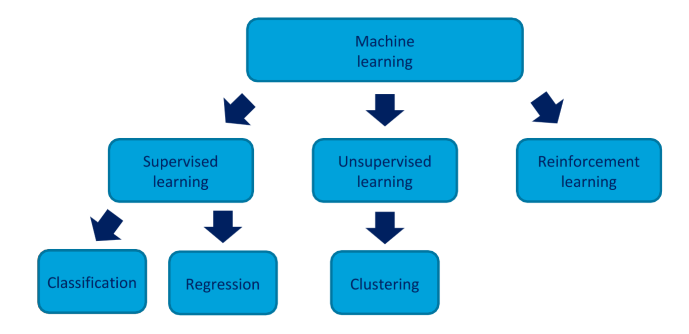

### Distance measures
A distance measure should fulfill four conditions:
1. d(P,Q) >= 0
2. d(P,Q) = 0 iff P = Q
3. d(P,Q) = d(Q,P)
4. d(P,Q) =< d(P,W) + d(W,Q) (triangle inequality)
- There are many ways to construct a distance measure

### Euclidean distance
- P = {p1,p2,...,pn}
- Q = {q1,q2,...,qn}

The Euclidean distance (d) from P to Q
- d(P,Q) = √(q1-p1)^2+(q2-p2)^2+...+(qn-pn)^2
- = √Σ(qi-pi)^2

**Example:** 
- 2d plane
- P(5,5) and Q(9,8)
- Geometricaly
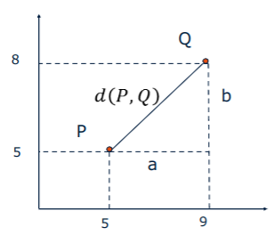
- d(P,Q) = √(9-5)^2+(8-5)^2 = √a^2 + b^2 = pietjeachoras

### Absolute (Manhattan) distance:
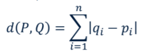

### Infinity distance:
- d(P,Q) = max(|q1 - q2|,....,|qn - pn|)

### Distance measures based on some property of two points
- Cosine distance = angle between lines from the origin to the points in question.
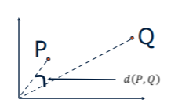
- Edit distance = number of inserts and deletes to change TS1 int TS2
- TS1 = {1,2,3,<ins>3</ins>,4,<ins>1</ins>,1} TS2 = {1,2,3,2,4,2,1}

### Clustering - Example of Unsupervised learning
#### Examples of application
- Customer marketing segmentation
- Patient clustering
- Image segmentation
- Image compression
- Earthquake analysis
- Student clustering
- Weather zones
- Daily energy use

### Classification - Example of supervised learning
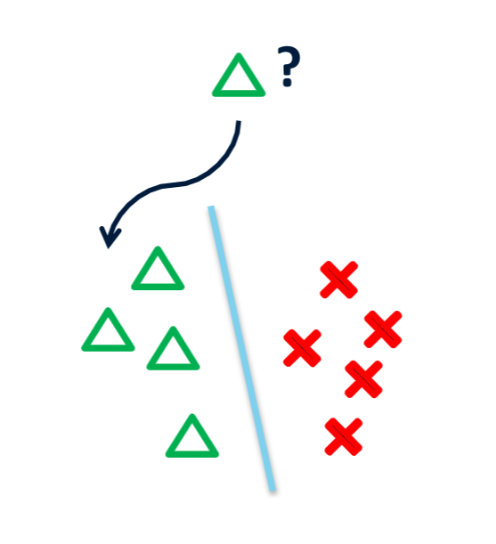

- Many ways to classify:
  - Linear/Logistic 
  - Regression
  - Support Vector Machine
  - Naïve Bayes
  - Decision Trees
  - k-Nearest Neighbors
  - Neural Networks
- First get a clear idea about the <ins>research question</ins> and the <ins>available data</ins>

#### Many different methods, tradeoff between accuracy and interpretability
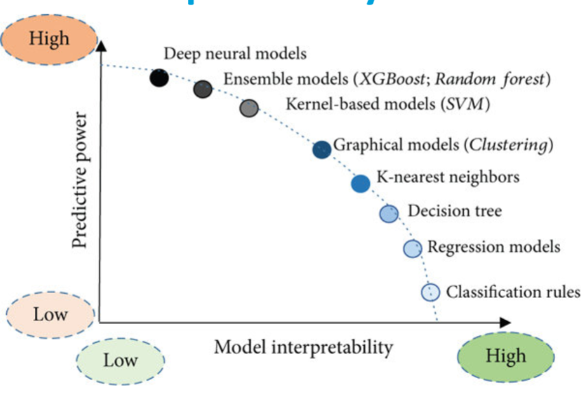

##### But how do we choose a proper one?
**Bias** 
- Bias refers to the error that is introduced by modeling a real life problem (that is usually extremely complicated) by a much simpler problem
**Variance** 
- Variance refers to how much your estimate would change by if you had a different training data set

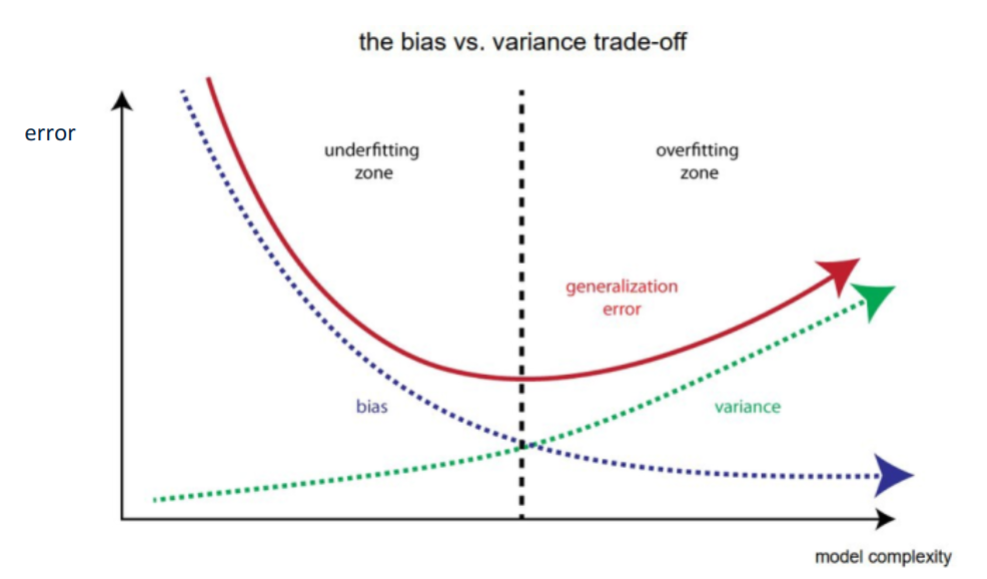

### What to do for exam?
- Problem suitable for data mining
- Learning types
- Data mining tasks 
- Definition of distance measure (four conditions)
- Definitions of Euclidean distance, absolute distance, infinity distance, edit distance 
- Given two time series/strings: know how to compute Euclidean distance, absolute distance, infinity distance, edit distance
- Solve exercises of the type given in the homeworks (next slide)

## Lecture 3 15/9/22 Mathematical modeling
### Data modeling
- A model is a mathematical representation of a system. Simple copy of reality.
- A system is a set of things working together as parts of a mechanism or an interconnecting network.
- Mathematical models can help people know, understand, or simulate the model represents.
- A model may help to explain a system and to study the effect of different components, and to make predictions about behaviour.
- Model can be used to investigate the real world.
- When robust and accurate they van replace lab experiments

#### Applications
- Natural Sciences: Physics, Biology, Earth Sciences, Meteorology, Engineering.
- Social Sciences: Economics, Pschycology, Sociology, Political Science.

**Example of a system(and of a possible model)**
System is a set of interacting or interdependent components forming an integrated whole:
- The Fighter 
- A biological system (a cell, an organ, etc.)
- A specific netural environment (Amazon forest)

*The model*
INPUT(u): Rudders, aileron, thrust. 
MODEL: x(t+1) = Fx(t) + Gu(t) and y = H x(t) 
OUTPUT(y): velocity, pitch angel  
u,y: measured time or frequency domain signals

 
#### Machanistic models
- A mechanistic model tries to model the relation between input and output of a system by understanding and replicating the individual components of the system and their interactions. 
- They have tangible, physical aspects.
#### Statistical models
- A statistical model seeks only to best described the data, the relation between observed input and output, without trying to replicate the real functioning of the system.

### From data to model 
- This is an identification problem. 
- Given the observations, we want to retrieve the model that generated those.
- Thus: this becomes a problem of model fitting. 
- Most popular model fitting application is linear regression models.

### Linear regression models
- y is the output, for instance, the observations you have collected
- x is the explenatory variable (the regressor), a quantity the observation depends on
- linear regression is an approach to modeling the relationship between y and x

#### Why useful?
- Investigate possible association
- Interpolation of missing data
- Forecasting

**Example linear regression: ** 
| K  | 1 | 2 | 3 | 4 |
|----|---|---|---|---|
| Xk | 0 | 1 | 2 | 3 |
| Yk | 1 | 2 | 5 | 4 |

- Calculate by using:
  - argmin SUM(Yk - (a * Xk + b))^2

- Calculating errors
  - e1 = (1-(a * 0 + b))^2 = 1  + b^2  - 2b
  - e2 = (2-(a * 1 + b))^2 = 4  + a^2  + b^2 - 4a  - 4b +  2ab
  - e3 = (5-(a * 2 + b))^2 = 25 + 4a^2 + b^2 - 20a - 10b + 4ab
  - e4 = (4-(a * 3 + b))^2 = 16 + 9a^2 + b^2 - 24a - 8b  + 6ab  

- Calculating derivative
  - Dva = (0 + 0 + 0) + (0 + 2a + 0 - 4 + 2b) + (0 + 8a + 0 - 20 + 0 + 4b) + (0 + 18a + 0 - 24 + 0 + 6b)
  - Dva = 28a + 48 + 12b
  - Dvb = (0 + 2b - 2) + (0 + 0 + 2b + 0 - 4 + 2a) + (0 + 0 + 2b + 0 - 10 + 4a) + (0 + 0 + 2b + 0 - 8 + 6a)
  - Dvb = 8b - 24 + 12a 

- Calculating a and b
  - 8b - 24 + 12a = 0
  - 8b = 24 - 12a
  - b = 3 - 3/2a
  - Fill in b:
    - 28a - 48 + 12b = 0
    - 28a - 48 + 12 * (3-3/2a) = 0
    - 28a - 48 + 36 - 18a = 0
    - 10a - 12 = 0
    - 10a = 12
    - a = 12/10
    - a = 6/5
  - Fill in a:
    - b = 3 - 3/2a
    - b = 3 - 3/2 * 6/5
    - b = 6/5

- Final fitted line is:
  - Ya = 6/5x + 6/5

### Overfitting
- Fitting model too complicated with respect to true model.
- Easy to occur with high noise.
- Model becomes useless for prediction.

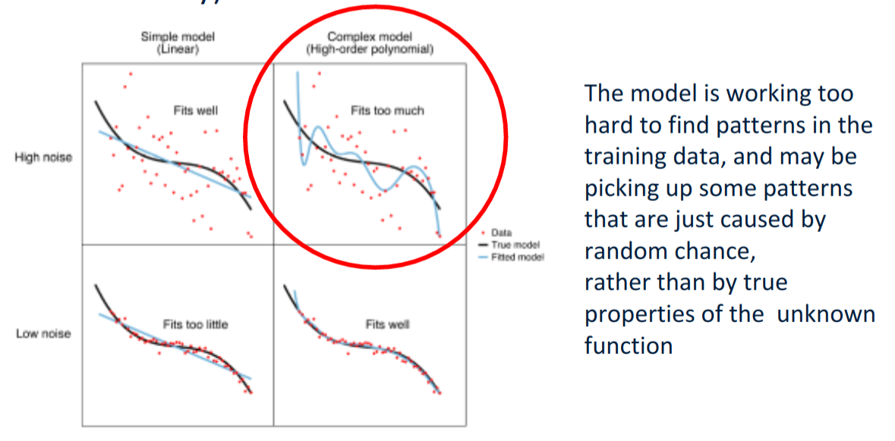

### What to know for the exam
- Given a set of correlated variables x and y, know how to compute the linear equation of the regression line through the data (y = ax+b)
- Know how to solve exercises as the one given at the eind of this lecture.

## Lecture 4 19/9/22 Search
- Many AI approaches rely on search to find the 'best' solution to a problem.
- By searching through the possible solutions we van find the solution we need.

**Example Maze**
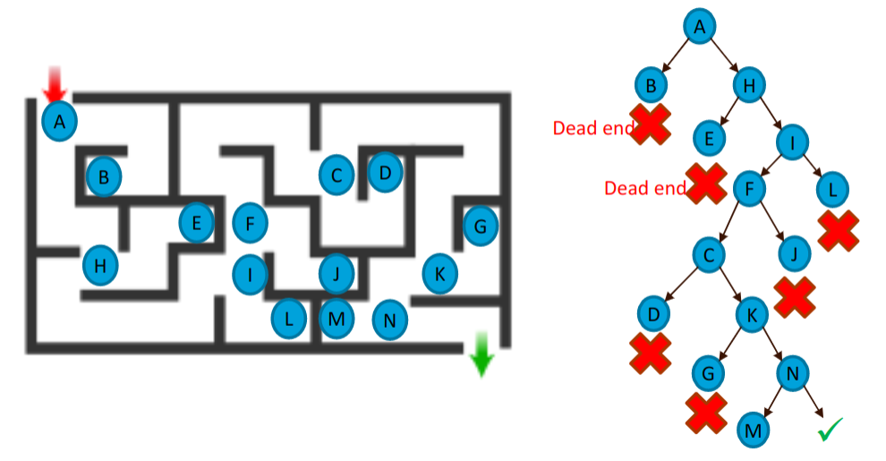

### Tree terminology
- insert image of tree
- <b>Root:</b> node without parent (A)
- <b>Descendant</b> of a node: child, grandchild, grand-grandchild, etc.
- <b>Internal node:</b> node with at least one child (A,B,C,F)
- <b>Leaf node:</b> node without childrne (E,I,J,K,G,H,D)
- <b>Ancestors</b> of a node: parent, grandparent, grand-grandparent, etc.
- <b>Subtree:<b> tree consisting of a node and its descendants (C with G and H)

### Searching tree algorithms
#### Breadth first search
1. Look at the root, if it isn't a solution...
2. Look at all children of the root, if no solution...
3. Look at all the grandchildren of the root, if no solution...
4. Etc.

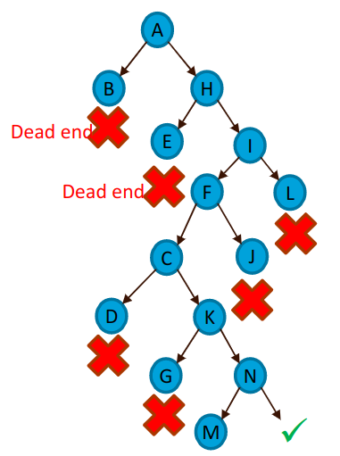

- Search order: A, B, H, E, I, F, L, C, J, D, K, G, N, M, Exit

#### Depth first search
- In depth first search we go as deep as we can with each path, until we reach a leaf, then we backtrack up the tree.

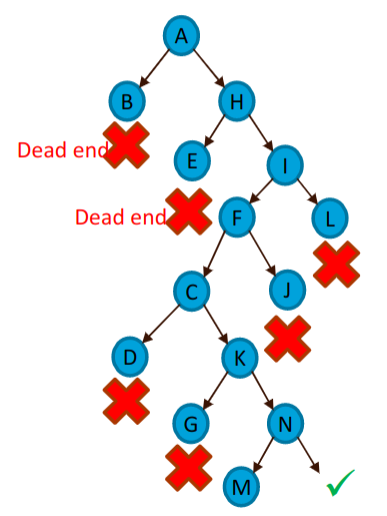

- Search order: A, B, H, E, I, F, C, D, K, G, N, M exit (never visit j and L)

### Search in games
- Searching depth (because looking at all the options is inefficient)
	- Number of state transisitions (moves) from the root of search to the considered state position (measured in ply)
- Branching factor b
	- Average number of successor nodes (moves)

#### Example: Sudoku 4x4
- 12 cells to fill
- Consider that we fill cells one-by-one (fixed order)
- Each node has 4 children (1,2,3,4)
	- some childeren will be discarded
- Max tree depth: 12
- Branching factor: 4

### Adversary Search
- Two (or more) opponents, each trying to maximize their expectations
- Player 1 is called MAX
	- Obtain the maximum result
	- Minimize that of the opponent
- Player 2 is called MIN
	- Obtain the minimim result
	- Maximize that of the oppenent

#### Game tree (2-player, deterministic, turn-taking)

### MiniMax Search (Vn Neumann, 1928)

### Pruning with minimax trees
- Minimizing game trees

### Heuristic Search
- Truncate the game tree (limited search depth)
- Use a *(static heuristic) evaluation function* at the leaves
- Minimax (with pruning) on the reduced game tree
- Playing is solcing a sequence of these game trees

#### Heuristic Evaluation Function
- Heuristics values must be correlated with the true (game-theoric) value.
- For Chess, typically <ins>linear</ins> weighted sum of features
	- Eval(s) = w1 * f1(s) + w2 * f2(s) + ... + wn * fn(s)
	- e.g., w1 = 9 with
	- f1(s) = (number pf white queens) - (number of black queens), etc.

### What to know for exam?
- Tree terminology
- Using trees for search
- Breadth first search
- Depth first search
- Minimax search
- pruning

